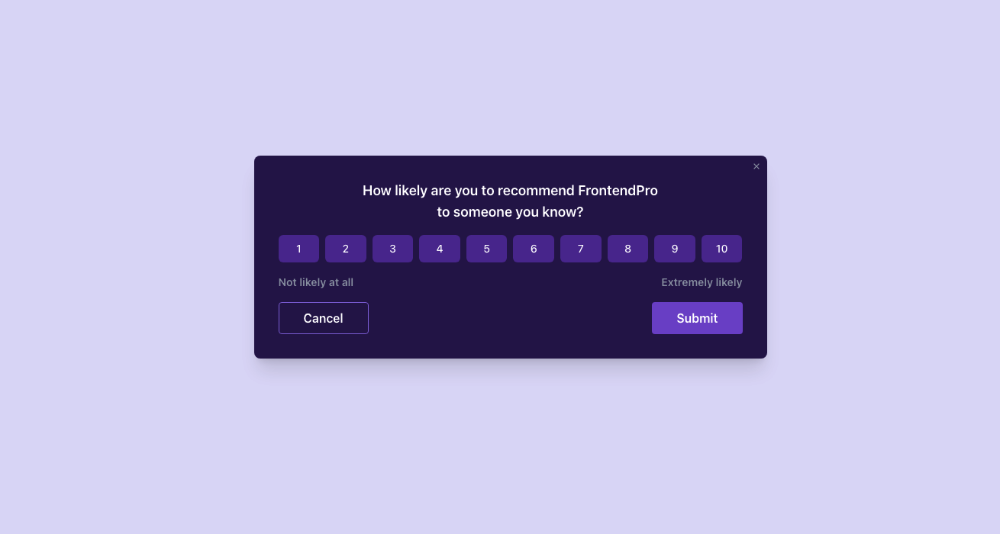

# 📝 Feedback Modal

A simple and responsive feedback modal built using **Vite** and **Tailwind CSS**. Designed for easy integration into modern web applications.

## 🚀 Features

- ⚡️ Built with [Vite](https://vitejs.dev/) for fast development
- 🎨 Styled using [Tailwind CSS](https://tailwindcss.com/)
- 💬 Clean and accessible feedback modal UI
- 📱 Fully responsive and mobile-friendly
- 🔧 Easily customizable

## 📸 Preview



## 🛠️ Tech Stack

- **Framework**: [Vite](https://vitejs.dev/)
- **Styling**: [Tailwind CSS](https://tailwindcss.com/)
- **Language**: HTML, CSS, JavaScript
- **Package Manager**: [Bun](https://bun.sh/)

## 📦 Installation

```bash
# Clone the repository
git clone https://github.com/NickM101/feedback-modal
cd feedback-modal

# Install dependencies
bun install

# Start development server
bun run dev
```
